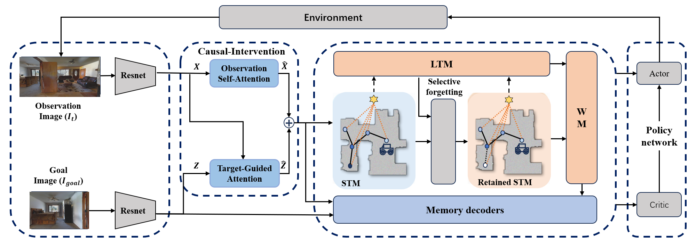

# CauMemNav:Causal Memory Model for Visual Navigation

CauMemNav: Causal Memory Model for Visual Navigation. A causally-inspired memory framework using dual-stream causal attention for visual deconfounding, topological STM with goal-driven dynamic pruning, and selective forgetting for robust long-horizon navigation. PyTorch + Habitat.

### Overview
CauMemNav is a causally-inspired memory construction framework for image-goal visual navigation. It addresses a critical limitation of existing memory-based navigation methods: they store observed features indiscriminately, allowing visual confounders (e.g., background textures, lighting changes, distractors) to form spurious associations that trap the agent in irreversible decision loops during long-horizon navigation.



CauMemNav  embeds a deconfounding mechanism at the very source of memory construction and maintains it throughout the entire memory lifecycle, effectively severing backdoor paths from confounders to memory representations. The framework is built on the memory-goal consistency principle: working memory robustness fundamentally depends on causal consistency with the navigation goal, not merely on memory capacity or structural complexity.


============================================================
## Installing Dependencies
The CauMemNav experiments described in this repository are conducted entirely on the [`Habitat-Sim`](https://github.com/facebookresearch/habitat-sim)simulator platform.

Prerequisite:To fully reproduce the experimental results, you must install the Habitat-Sim and Habitat-Lab environments first.

Please refer to the installation guide below to configure the base environment before proceeding with the CauMemNav experiments.
1. **Preparing conda env**

   Assuming you have [conda](https://docs.conda.io/projects/conda/en/latest/user-guide/install/) installed, let's prepare a conda env:
   ```bash
   # We require python>=3.9 and cmake>=3.14
   conda create -n habitat python=3.9 cmake=3.14.0
   conda activate habitat
   ```

1. **conda install habitat-sim**

    To install habitat-sim with bullet physics
      ```
      conda install habitat-sim withbullet -c conda-forge -c aihabitat
      ```
      Note, for newer features added after the most recent release, you may need to install `aihabitat-nightly`. See Habitat-Sim's [installation instructions](https://github.com/facebookresearch/habitat-sim#installation) for more details.

1. **pip install habitat-lab stable version**.

      ```bash
      git clone --branch stable https://github.com/facebookresearch/habitat-lab.git
      cd habitat-lab
      pip install -e habitat-lab  # install habitat_lab
      ```
1. **Install habitat-baselines**.

    The command above will install only core of Habitat-Lab. To include habitat_baselines along with all additional requirements, use the command below after installing habitat-lab:

      ```bash
      pip install -e habitat-baselines  # install habitat_baselines
      ```
Check habitat installation by running `python examples/benchmark.py` in the habitat-lab folder.

## Setup

Clone the repository and install other requirements:
```
git clone https://github.com/jako-ty/CauMemNav-Causal-Memory-Model-for-Visual-Navigation/
cd CauMemNav-Causal-Memory-Model-for-Visual-Navigation
```

Due to the large size of the Gibson, MP3D, and HM3D datasets, they are not pre-packaged. Please download the datasets from the official links below and place them in the corresponding directories as instructed.

### Scenes datasets

| Scenes models | Extract path | Archive size |
| --- | --- | --- |
| [HM3D](https://github.com/facebookresearch/habitat-sim/blob/main/DATASETS.md#habitat-matterport-3d-research-dataset-hm3d) | `data/scene_datasets/hm3d/{split}/00\d\d\d-{scene}/{scene}.basis.glb` | 130 GB |
| [Gibson](https://github.com/facebookresearch/habitat-sim/blob/main/DATASETS.md#gibson-and-3dscenegraph-datasets) | `data/scene_datasets/gibson/{scene}.glb` | 1.5 GB |
| [MatterPort3D](https://github.com/facebookresearch/habitat-sim/blob/main/DATASETS.md#matterport3d-mp3d-dataset) | `data/scene_datasets/mp3d/{scene}/{scene}.glb` | 15 GB |

These datasets can be downloaded follow the instructions [here](https://github.com/facebookresearch/habitat-sim/blob/main/DATASETS.md).

### Task datasets

| Task                                                                              | Scenes | Link | Extract path | Config to use                                                                                                          | Archive size |
|-----------------------------------------------------------------------------------| --- | --- | --- |------------------------------------------------------------------------------------------------------------------------| --- |
| [Image goal navigation](https://arxiv.org/abs/2211.15876)                         | HM3D | [imagenav_hm3d_v3.zip](https://dl.fbaipublicfiles.com/habitat/data/datasets/imagenav/hm3d/v3/instance_imagenav_hm3d_v3.zip) | `data/datasets/imagenav/hm3d/v3/` |  [`datasets/imagenav/hm3d_v3.yaml`](habitat-lab/habitat/config/habitat/dataset/instance_imagenav/hm3d_v3.yaml) | 517 MB |
| [Image goal navigation](https://github.com/facebookresearch/habitat-lab/pull/333) | Gibson | [pointnav_gibson_v1.zip](https://dl.fbaipublicfiles.com/habitat/data/datasets/pointnav/gibson/v1/pointnav_gibson_v1.zip) | `data/datasets/pointnav/gibson/v1/` | [`datasets/imagenav/gibson.yaml`](habitat-lab/habitat/config/habitat/dataset/imagenav/gibson.yaml)                                 | 385 MB |
| [Image goal navigation](https://github.com/facebookresearch/habitat-lab/pull/333) | MatterPort3D | [pointnav_mp3d_v1.zip](https://dl.fbaipublicfiles.com/habitat/data/datasets/pointnav/mp3d/v1/pointnav_mp3d_v1.zip) | `data/datasets/pointnav/mp3d/v1/` | [`datasets/imagenav/mp3d.yaml`](habitat-lab/habitat/config/habitat/dataset/imagenav/mp3d.yaml)                                     | 400 MB |

## Usage

### Training:
For training the  CauMemNav on the Image Goal Navigation task:
```
python -u -m habitat_baselines.run \
  --config-name=imagenav/ddppo_caumemnav.yaml
```

### For evaluation:
For evaluating the trained model:
```
python -u -m habitat_baselines.run \
  --config-name=imagenav/ddppo_caumemnav.yaml \
  habitat_baselines.evaluate=True
```

## Todo
Due to certain reasons, we are not currently offering pre-trained models; we will make them available after further adjustments and updates in the future.

## Result
After conducting training and evaluation in accordance with the experimental standards,the CauMemNav in Gibson should get about 0.824 Success and0.688 SPL.

Of course, since we do not currently provide pre-trained models, the results of independent training and evaluation may contain some errors, but they should not differ significantly from the results we report.


